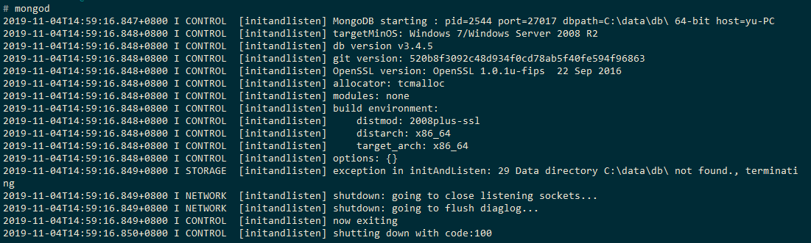
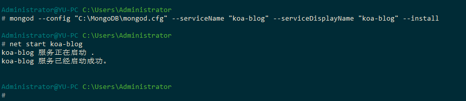
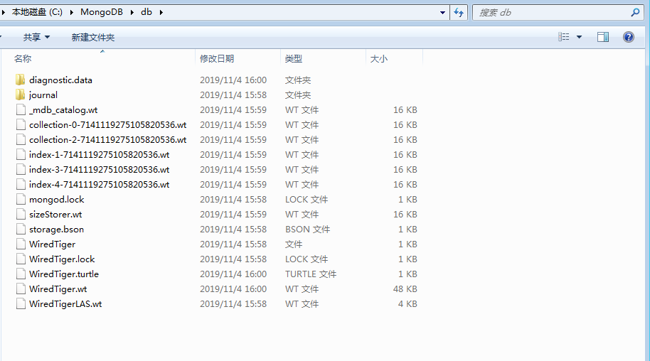
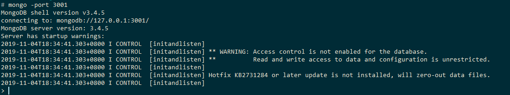
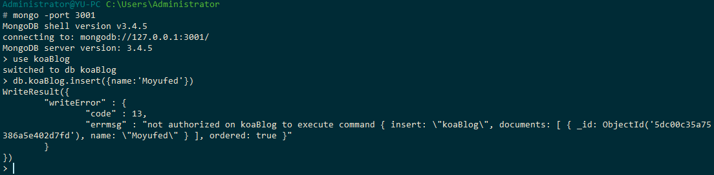

*我们使用  MongoDB 为应用提供可扩展的高性能数据存储解决方案。*

> MongoDB是一种面向文档的数据库管理系统，用C++等语言撰写而成，以此来解决应用程序开发社区中的大量现实问题。2007年10月，MongoDB由10gen团队所发展。2009年2月首度推出。 - 维基百科

本节实战将在 Windows 系统安装 MongoDB （Linux 下安装 MongoDB 可以参考 [这里](http://blog.moyufed.com/2019/09/04/Linux%E4%B8%AD%E5%AE%89%E8%A3%85Nodejs%E5%92%8CMongoBD%E4%BB%A5%E5%8F%8AMongoDB%E8%AE%BE%E7%BD%AE/) ），将包含如下内容：

- 安装 MongoDB
- MongoDB 设置、启动、连接
- MongoDB 用户创建、更新、删除


### 安装MongoDB

下载 MongoDB 安装文件，[下载地址](http://dl.mongodb.org/dl/win32/x86_64)， 可以从其中选择需要的版本（本机为例：mongodb-win32-x86_64-2008plus-ssl-3.4.5-signed.msi）。下载完成后之后，双击执行安装，安装过程不再描述。

为了方便在命令行执行 `mongod` 、`mongo` 命令, 需要将安装路径添加到系统环境变量。
在**计算机**-**属性**-**高级系统设置**-**环境变量**，找到path，双击编辑，在里面添加上面的安装目录（本机为例：`C:\Program Files\MongoDB\Server\3.4\bin`），添加完成后可以在命令行执行：

```shell
$ mongod
```

执行之后获得如下图结果，证明我们的环境变量添加成功：



### MongoDB设置、启动、连接

我们的数据是以文件的方式存储在硬盘上面的，因此需要在系统磁盘新建数据库存放目录（以本机为例： `C:\MongoDB` ， `C:\MongoDB\db`  ， `C:\MongoDB\log` ）。

#### 方式一：命令行指定数据库位置

打开命令面板（快捷键 win+r 输入 cmd 回车），注意，需要**以管理员身份**在命令行执行：

```shell
$ mongod --bind_ip 127.0.0.1 --logpath "C:\MongoDB\log\mongod.log" --logappend --dbpath "C:\MongoDB\db" --port 3001 --serviceName "koa-blog" --serviceDisplayName "koa-blog" --install
```

上面的命令实际上是对 MongoDB 数据库进行了设置：

- `bind_ip`：绑定IP地址，这里的127.0.0.1是指只有本机可以访问。
- `logpath`：指定MongoDB的日志记录文件的位置。
- `logappend`：指定日志的记录形式为追加形式。
- `dbpath`：指定数据库的位置（注意，这不是安装MongoDB的位置，而是存放数据的位置）。
- `port`：指定数据库运行在哪个端口，上面的示例选择3001端口。

*后面的 `--serviceName "koa-blog" --serviceDisplayName "koa-blog" --install` 是将我们的这个命令安装成 Windows 的服务，可以在启动 Windows 系统的时候就启动这个服务，当然我们可以选择去掉这一段，那么以后需要启动服务器都要执行一次命令。*

#### 方式二：使用配置文件

为了方便并且有效可靠的记住服务器的配置，可以写一个配置文件，我们新建一个 `C:\MongoDB\mongod.cfg` 文件，内容为：

```
systemLog:
 destination: file
 path: "C:\\MongoDB\\log\\mongod.log"
 logAppend: true
net:
 bindIp: 127.0.0.1
 port: 3001
storage:
 dbPath: "C:\\MongoDB\\db"
```

接下来执行：

```shell
$ mongod --config "C:\MongoDB\mongod.cfg" --serviceName "koa-blog" --serviceDisplayName "koa-blog" --install
```

这样我们就对数据库进行了设置，并且安装到了 Windows 的 service，实际效果和**方式一**是一样的。

#### 踩坑问题处理

如果发生如下[问题](https://stackoverflow.com/questions/37352869/why-am-i-getting-a-parser-error-on-my-yaml-config-in-mongodb-install)：

```
Error parsing YAML config file: YAML-cpp: error at line 2, column 13 : illegal map value
```

可以使用使用空格代替tab，在“:”之后也使用一个空格

> YAML doesn't really satisfy with tabs, then, use space instead before destination and storage. Don't forget to add a space after every ":" even in the lines systemLog and storage Finally, use quotes to enclose your pathes and double backslashes in these pathes.

#### 查看数据库配置是否成功

选择上面介绍的任一方式对数据库进行设置，执行成功之后，都可以看到 log 目录下面生成了一个 `.log` 后缀文件（本机为例：`C:\MongoDB\log\mongod.log` ），打开查看内容如下：

```power
2019-11-04T15:56:50.104+0800 I CONTROL  [main] Trying to install Windows service 'koa-blog'
2019-11-04T15:56:50.492+0800 I CONTROL  [main] Service 'koa-blog' (koa-blog) installed with command line '"C:\Program Files\MongoDB\Server\3.4\bin\mongod.exe" --config C:\MongoDB\mongod.cfg --service'
2019-11-04T15:56:50.492+0800 I CONTROL  [main] Service can be started from the command line with 'net start koa-blog'
```

#### 启动数据库

可以通过 `net start koa-blog` 启动服务器，我们来试试，以管理员身份在命令行执行：

```shell
$ net start koa-blog
```



现如图的结果，表示数据库已经启动，我们看到 `C:\MongoDB\db` 目录下多了一些文件，这些文件就是数据库生成的。



#### 在命令行连接数据库

打开命令行终端，执行以下命令即可连接到数据库：

```shell
$ mongo mongodb://127.0.0.1:3001
# 或者
$ mongo -port 3001
```

连接成功之后，可以看到如下图结果：



我们看到数据库是没有访问控制的，数据库的读写权限不受控制的。

### MongoDB 用户创建、更新、删除

*我们将启用  MongoDB 的用户访问控制，开启验证后，用户只能对数据库进行符合权限的操作。*

关于 MongoDB 访问权限的设置这里有 [`详细介绍`](https://docs.mongodb.com/master/tutorial/enable-authentication/) ，接下来开始实战。

#### 在 `admin` 数据库创建管理员

要使用访问控制，我们先确保有一个超级用户，这个用户在 `admin` 数据库里面创建，并且拥有 [`userAdmin`](https://docs.mongodb.com/master/reference/built-in-roles/#userAdmin) 或者[`userAdminAnyDatabase`](https://docs.mongodb.com/master/reference/built-in-roles/#userAdminAnyDatabase) 的权限，超级用户可以创建用户、授权或者删除用户权限、自定义权限。

**`admin` 数据库则主要存储 MongoDB 的用户、角色等信息。**

在前面的介绍中我们启动的数据库是没有开启访问控制的，不过即使这样，我们也可以在启动授权控制之前就创建超级用户，因为 MongoDB 提供了一个 [localhost exception](https://docs.mongodb.com/master/core/security-users/#localhost-exception) 来创建超级用户到 `admin` 数据库。

一旦超级用户被创建了，我们需要验证登录这个用户来创建更多用户，下面来看具体操作。

紧接之前实战，我们已经通过非授权的方式启动并连接到数据库，接下来就是创建超级用户:

```
> use admin
switched to db admin
```

上面的这个命令 `use admin` 能够切换到 `admin` 数据库，执行成功之后，我们就可以在 `admin` 数据库进行操作了。

那么首先来创建一个管理员用户，这个用户具有创建管理其他用户的权限：

```shell
> db.createUser(
   {
...     user: "admin",
...     pwd: "admin",
...     roles: [ { role: "userAdminAnyDatabase", db: "admin" } ]
...   }
... )

# 执行结果

Successfully added user: {
        "user" : "admin",
        "roles" : [
                {
                        "role" : "userAdminAnyDatabase",
                        "db" : "admin"
                }
        ]
}
```

上面的命令的 `···` 是换行，如果在命令行里面不能换行，可以整理成一行来执行。如：

```shell
> db.createUser( { user: "admin",pwd: "admin", roles: [ { role: "userAdminAnyDatabase", db: "admin" } ]} )
```

这其中 `user` 指的是我们的用户名， `pwd` 是密码，而 `roles` 里面配置的正是这个用户的权限。`userAdminAnyDatabase` 就是一个具有在其他数据库增删和管理用户的权限，`db` 指定了创建的这个管理员用户所在的数据库是 `admin`。

**注意：超级用户可以访问所有数据库，这个用户是被创建在 `admin` 管理数据库，`db` 指定数据库。**

#### 启动数据库访问控制

之前的启动数据库的方式并不是访问控制的，我们删掉之前安装的 Windows service , 以管理员身份执行 `sc delete koa-blog` ：

```shell
# 执行 exit 退出数据库连接
> exit
bye

# 删掉service
$ sc delete koa-blog
[SC] DeleteService SUCCESS
```

接着启用权限控制，执行下面的命令，**执行之前确保系统 MongoDB 进程关闭**，这里使用的 `--auth` 是用来开启授权启动：

```shell
$ mongod --config "C:\MongoDB\mongod.cfg" --serviceName "koa-blog" --serviceDisplayName "koa-blog" --auth --install

$ net start koa-blog
```

可以看到这种启动方式比之前多了一个 `--auth` 。

#### 在对应数据库创建用户

既然超级用户已经被我们创建好了（这个超级用户是在 `admin` 数据库），那么我们先连接数据库：

```shell
$ mongo -port 3001
```

为了测试在不验证用户的情况下是否能进行数据操作，我们先不登录这个超级用户，而是切换到一个数据库 `koaBlog`， 执行 `use koaBlog` 切换到 `koaBlog` 数据库。我们可以执行 `db` 查看当前的数据库。先来插入一条数据试试：

```shell
> db.koaBlog.insert({name:'Moyufed'})
```



我们看到 “not authorized on koaBlog to execute command” ，这就是说, 我们没有权限操作。

不能插入数据正是我们想要的结果，但是为了能够在这个数据库插入数据，我们就需要去创建有权限的用户了，

因此我们切换到 `admin` 数据库去登录账号：

```shell
> use admin
switched to db admin
> db
admin
> db.auth("admin", "admin")
1 # 返回1 授权成功, 否则返回0, 并提示失败
```

上面的命令执行完毕之后，我们就登录了数据库。先来看看怎么创建用户：

*使用  `db.createUser()` 添加用户，以及用户的 内置权限 或 用户定义权限 。*

我们上面创建的 `admin` 用户只能 [管理用户和权限](https://docs.mongodb.com/master/tutorial/manage-users-and-roles/)，如果要执行其它操作，如从数据库中查询数据，MongoDB 会返回错误。
下面我们来为 `koaBlog`创建一个有 [读写权限](https://docs.mongodb.com/master/reference/built-in-roles/#readWrite) 的用户：

```shell
# 执行
> use koaBlog
switched to db koaBlog


# 执行
> db.createUser(
...   {
...     user: "moyufed",
...     pwd: "123456",
...     roles: [ { role: "readWrite", db: "koaBlog" } ]
...   }
... )

# 结果
Successfully added user: {
        "user" : "moyufed",
        "roles" : [
                {
                        "role" : "readWrite",
                        "db" : "koaBlog"
                }
        ]
}
```

上面的示例中，我们切换到 `koaBlog` 数据库上创建用户， 因为只有在这里创建的用户才是这个数据库的用户， 才能在这里完成授权。

但是需要注意的是，我们刚刚创建的这个用户的信息是存放在 `admin` 库中的，为了验证，我们接着换到 `admin`库，看一下刚刚创建的用户，首先切换到 `admin` 数据库肯定要先 `use admin` ，接着执行下面的命令查找用户：

```shell
> use admin
switched to db admin
> db.system.users.find({user:'moyufed'})
{ "_id" : "koaBlog.moyufed", "user" : "moyufed", "db" : "koaBlog", "credentials" : { "SCRAM-SHA-1" : { "iterationCount" : 10000, "salt" : "dc1TCbvsO20LgyX0UsxoXg==", "storedKey" : "FQmO72ZNFkt9MSvH+5gZ6fd9h5M=", "serverKey" : "Oz0XFo+fne8sTS3yhXzYp3i942k=" } }, "roles" : [ { "role" : "readWrite", "db" : "koaBlog" } ] }
>
```

#### 使用创建的用户来新增数据

我们现在用新增的用户来连接数据库，下面的命令演示不同的方式启动和连接数据库，在连接数据库时就进行验证，和前面的 `admin` 用户登录的方式效果一样，前面的方式是先连接数据库再验证：

```shell
# 先退出连接
> exit
bye

# 重新连接数据库
$ mongo --port 3001 -u moyufed -p 123456 --authenticationDatabase koaBlog
MongoDB shell version v3.4.5
connecting to: mongodb://127.0.0.1:3001/
MongoDB server version: 3.4.5
>
```

既然已经验证成功，我们就可以尝试着来写入数据了，首先还是要切换到 `koaBlog` 数据库（我们的用户是在这个数据库创建的），接着我们来执行插入数据。

```shell
> use koaBlog
switched to db koaBlog
> db.koaBlog.insert({name:'Moyufed'})
WriteResult({ "nInserted" : 1 })
>
```

OK！我们已经能正常写入数据了。

**注意：登录一个用户的时候，要切换到与该用户对应的数据库，而用户是储存在 `admin` 数据库的**

#### 参数说明

| 参数                 | 描述                                                         |
| -------------------- | ------------------------------------------------------------ |
| --bind_ip            | 绑定服务IP，若绑定127.0.0.1，则只能本机访问，不指定默认本地所有IP |
| --logpath            | 定 MongoDB 日志文件，注意是指定文件不是目录                  |
| --logappend          | 使用追加的方式写日志                                         |
| --dbpath             | 指定数据库路径                                               |
| --port               | 指定服务端口号，默认端口 27017                               |
| --serviceName        | 指定服务名称                                                 |
| --serviceDisplayName | 指定服务名称，有多个 mongodb 服务时执行。                    |
| --install            | 指定作为一个 Windows 服务安装。                              |

#### 权限说明

| 分类                                       | role(角色)                                                   | 简要说明                                                     |
| ------------------------------------------ | ------------------------------------------------------------ | ------------------------------------------------------------ |
| 数据库用户角色(DB User Roles)              | `read` `readWrite`                                           | 为某个数据库创建一个用户, 分配该数据库的读写权力             |
| 数据库管理员角色(DB Admin Roles)           | `dbAdmin` `dbOwner` `userAdmin`                              | 拥有创建数据库, 和创建用户的权力                             |
| 集群管理角色(Culster Administration Roles) | `clusterAdmin` `clusterManager` `clusterMonitor` `hostManager` | 管理员组, 针对整个系统进行管理                               |
| 备份还原角色(Backup and Restoration Roles) | `backup` `restore`                                           | 备份数据库, 还原数据库                                       |
| 所有数据库角色(All-Database Roles)         | `readAnyDatabase` `readWriteAnyDatabase``userAdminAnyDatabase``dbAdminAnyDatabase` | 拥有对admin操作的权限                                        |
| Superuser Roles(超级管理员)                | `root`                                                       | `dbOwner` `userAdmin` `userAdminAnyDatabase`这几个角色角色提供了任何数据任何用户的任何权限的能力，拥有这个角色的用户可以在任何数据库上定义它们自己的权限 |

#### 修改用户角色

更新用户

```shell
> db.updateUser([用户名],{用户对象, 与创建时一样})  # 后面还有一个可选参数writeConcern, 一般不写
```

创建用户时和更新用户都需要属性`user` `pwd` `roles`成功修改后没有任何提示. 如下:

```shell
# 修改密码并且修改角色为只读
> db.updateUser('test',{user:'test',pwd:'admin',roles:[{role:'read',db:'testDB'}]})
>
```

以上需要注意的就是, `roles`数组里的对象数据`role` `db`两个都需要给出, 否则会出现错误

删除用户

```shell
> use testDB
switched to db testDB
> db.dropUser('test')
true
>
```

#### 总结

- 一定切换到对应的数据库去创建用户， 否则在进行认证的时候, 会提示找不到用户。
- 一定要到对应的数据库上去认证用户，否则会认证授权失败。
- 不是所有人都能操作 `admin` 数据库， 分配给用户权限的时候，一定要谨慎。
- 修改用户和删除用户都和创建用户一样，需要切换到数据库管理员的身份。也就是需要先切换到`admin`库完成认证才能进行后面的操作，同样需要到对应数据库去操作用户， 因为用户是跟着库走的。

#### 参考资料

[Why am I getting a parser error on my YAML config in MongoDB --Install](https://stackoverflow.com/questions/37352869/why-am-i-getting-a-parser-error-on-my-yaml-config-in-mongodb-install)

[Enable Access Control](https://docs.mongodb.com/master/tutorial/enable-authentication/)


经过本节实战，我们安装和配置好了 MongoDB ，下一步，我们来了解项目的环境配置…