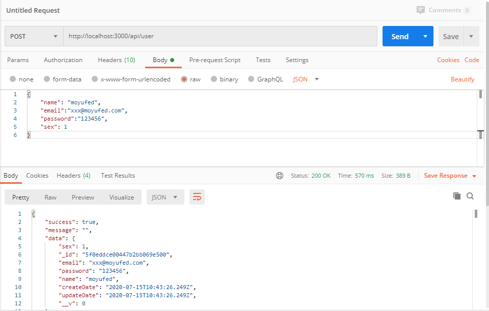
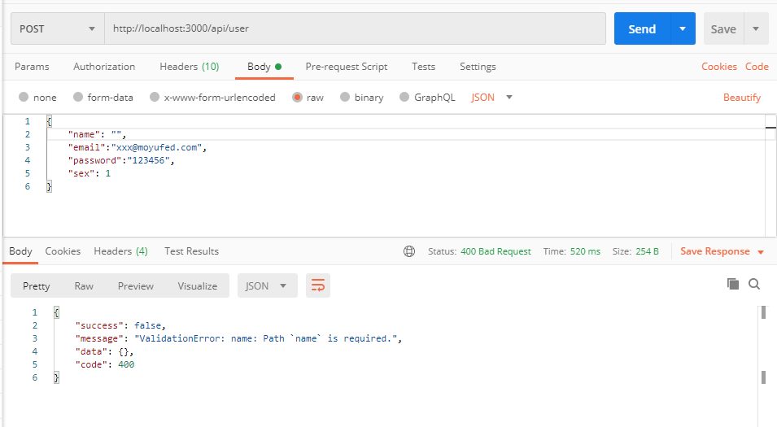

*我们使用 RESTful 的风格设计一个接口，方便前后端进行通信，实现前后端分离。*

在开始实战之前，先来结合项目实际，了解一下 RESTful API 。

### RESTful API 设计

#### 域名相关

理论上应该将 API 部署在专门的域名如： `https://api.example.com` ，但由于目前 API 很简单，这里准备放在 `https://example.org/api/` 下面，在前面的实战中，已经为路由增加 `/api` 前缀。

#### 版本

需要使用到版本的时候，将 API 的版本号放入URL，比如： `https://example.com/api/v1/` 。

#### 访问路径

在设计访问路径时将不同的资源归属到不同的路径，由于资源都是存在数据库中的集合，这里使用复数名词来结尾，如：

```
https://example.com/api/v1/articles
https://example.com/api/v1/tags
```

#### 请求方式

常用到的HTTP请求方式和对应的功能：

- GET：获取数据
- POST：创建数据
- PUT：更新完整数据
- PATCH：更新数据（提供改变的属性）
- DELETE：删除数据

不常用的请求方式还有 `HEAD` 和 `OPTIONS` 。

#### 设计API

**请求类型和路径代表的功能**

以文章接口 `articles` 为例：

| 类型   | 地址                        | 描述                         | 返回内容     |
| ------ | --------------------------- | ---------------------------- | ------------ |
| GET    | `/api/v1/articles`          | 用来获取文章列表             | 文章列表数组 |
| POST   | `/api/v1/articles`          | 用来新建文章                 | 文章详情     |
| GET    | `/api/v1/articles/:id`      | 用来获取某一篇文章的详细信息 | 文章详情     |
| PUT    | `/api/v1/articles/:id`      | 用来更新某一篇文章的全部信息 | 文章详情     |
| PATCH  | `/api/v1/articles/:id`      | 用来更新某一篇文章的部分信息 | 文章详情     |
| DELETE | `/api/v1/articles/:id`      | 删除某一篇文章               | 空对象       |
| GET    | `/api/v1/articles/:id/tags` | 获取某一篇文章的标签列表     | 标签列表     |

**常用参数**

这里结合个人实际，采取如下的参数

- ?limit=10：指定返回记录的数量
- ?offset=10：指定返回记录的开始位置。
- ?page=2&pageSize=10：指定第几页，以及每页的记录数。
- ?sortby=name&order=asc：指定返回结果按照哪个属性排序，以及排序顺序。
- ?articlesId=1：指定筛选条件

#### 状态码

服务器向用户返回的状态码和提示信息，常见的有以下一些（方括号中是该状态码对应的HTTP动词）：

- 200 OK - [GET]：服务器成功返回用户请求的数据，该操作是幂等的（Idempotent）。
- 201 CREATED - [POST/PUT/PATCH]：用户新建或修改数据成功。
- 202 Accepted - [*]：表示一个请求已经进入后台排队（异步任务）
- 204 NO CONTENT - [DELETE]：用户删除数据成功。
- 400 INVALID REQUEST - [POST/PUT/PATCH]：用户发出的请求有错误，服务器没有进行新建或修改数据的操作，该操作是幂等的。
- 401 Unauthorized - [*]：表示用户没有权限（令牌、用户名、密码错误）。
- 403 Forbidden - [*] 表示用户得到授权（与401错误相对），但是访问是被禁止的。
- 404 NOT FOUND - [*]：用户发出的请求针对的是不存在的记录，服务器没有进行操作，该操作是幂等的。
- 406 Not Acceptable - [GET]：用户请求的格式不可得（比如用户请求JSON格式，但是只有XML格式）。
- 410 Gone -[GET]：用户请求的资源被永久删除，且不会再得到的。
- 422 Unprocesable entity - [POST/PUT/PATCH] 当创建一个对象时，发生一个验证错误。
- 500 INTERNAL SERVER ERROR - [*]：服务器发生错误，用户将无法判断发出的请求是否成功。

> 来自 [阮一峰的网络日志-RESTful API 设计指南](http://www.ruanyifeng.com/blog/2014/05/restful_api.html) 。

#### 响应数据和错误处理

这里推荐使用 JSON 作为响应数据，主要结构如下：

```json
{
    "success": true,
    "message": "",
    "data": {},
    "code": 200
}
```

当请求处理成功时，`success` 为 `true` ，如果状态码是 `4xx`，应向用户返回出错信息，比如客户端发送了错误的请求，可以响应一个 `400` 状态码和错误描述。

为了前端可以统一处理响应，这里可以返回如下：

```json
{
    "success": false,
    "message": "错误信息",
    "data": {},
    "code": "状态码"
}
```

了解 RESTful API 设计的风格，下面开始来进行实战。

### 响应格式统一

先来新增一个中间件 `app/middleware/response_handler.js` ，在里面导出一个用于格式化响应的方法：

```js
// app/middleware/response_handler.js

module.exports = () => {
    // 导出一个方法
    return async (ctx, next) => {
        try {
            // 为ctx增加一个setResponse函数用于设置响应数据
            ctx['setResponse'] = async (data = {}) => {
                ctx.type = 'json';
                ctx.body = {
                    success: true,
                    message: "",
                    data,
                    code: 200,
                };
            };
            await next();
        } catch (err) {
            // 4xx的错误返回给客户端
            if (ctx.status >= 400 && ctx.status < 500) {
                ctx.body = {
                    success: false,
                    message: err.message,
                    data: {},
                    code: ctx.status,
                };
            }
        }
    };
};
```

可以看到当在使用该中间件时会自动给上下文 `ctx` 添加一个 `function` ，在需要响应数据的地方调用 `ctx.setResponse()` 就可以实现 JSON 数据响应。使用中间件：

```diff
// app.js

// ...

// 引入logger
const logger = require('./app/middleware/logger');
+ const responseHandler = require('./app/middleware/response_handler');

// ...

app.use(logger()); // 处理log的中间件
+ app.use(responseHandler()); // 处理响应的中间件

// ...
```

在需要进行响应的地方调用，比如之前写的创建文章接口：

```diff
// app/controller/article.js

const { article } = require("../service"); // 引入service

class ArticleController {
  async create(ctx) {
    try {
      const newArticle = await article.create({
        title: "第一条数据",
        content: "从零开始的koa实战",
        summary: "实战"
      });
-       ctx.body = newArticle;
+       ctx.setResponse(newArticle);
    } catch (err) {
+       ctx.status = 400;
      throw new Error(err);
    }
  }
}

module.exports = new ArticleController();
```

重启服务之后，再次访问 http://localhost:3000/api/article ，可以得到如下结果，正好是需要的响应格式：

```json
{"success":true,"message":"","data":{"status":1,"_id":"5f0d84f85064d0234406383e","title":"第一条数据","content":"从零开始的koa实战","summary":"实战","createDate":"2020-07-14T10:12:08.875Z","updateDate":"2020-07-14T10:12:08.875Z","__v":0},"code":200}
```

那错误的请求会怎么响应？这将在接下来的实战中进行验证。

### 注册接口

#### model

为了实现用户注册，我们需要新增一个用户的集合，这里创建 `user` 模型，在 `app/model` 目录下新增一个 `user.js` ：

```js
// app/model/user.js

// 引入 Mongoose
const mongoose = require('mongoose');
const Schema = mongoose.Schema;
const UserSchema = new Schema({
    email: { type: String, match: /^(\w)+(\.\w+)*@(\w)+((\.\w+)+)$/, required: true, unique: true }, // 用户邮箱, 正则匹配，必填, 唯一
    password: { type: String, minlength: 6, required: true }, // 用户密码，6-32位
    name: { type: String, trim: true, minlength: 1, maxlength: 32, required: true, unique: true }, // 用户名，去除空格，1-32个字符，必填, 唯一
    avatarUrl: String,  // 用户头像
    sex: {
        type: Number,
        default: 0,
        enum: [0, 1, 2] // 只能是 0 1 2
    }, // 性别 0未设置 1男 2女
}, {
    timestamps: { // 使用时间戳
        createdAt: 'createDate', // 将创建时间映射到createDate
        updatedAt: 'updateDate' // 将修改时间映射到updateDate
    }
});

module.exports = mongoose.model('User', UserSchema);
```

#### service

mongoose 对 `Schema` 的定义可以设置类型、验证条件、是否必填等，这可以参考[文档](https://mongoosejs.com/docs/validation.html) ，定义好 model 之后，可以在 `service` 里面用来操作集合。

新建对应的 service ，根据前面的实战，这里代码如下：

```js
// app/service/user.js

const userModel = require('../model/user');
const Service = require('./base');

class UserService extends Service {
    constructor() {
        super(userModel)
    }
    // ...
}

module.exports = new UserService();


// app/service/index.js

const article = require('./article');
const user = require('./user');

module.exports = {
    article, user
};
```

#### controller

接下来就需要将在 `controller` 中将方法指定到 `service` 的用户创建逻辑，比如：

```js
// app/controller/user.js

const { user } = require("../service"); // 引入service

class UserController {
  async create(ctx) {
    try {
      const { email, password, name, sex } = ctx.request.body;
      const newUser = await user.create({
        email, password, name, sex
      });
      ctx.setResponse(newUser);
    } catch (err) {
      ctx.status = 400;
      throw new Error(err);
    }
  }
}

module.exports = new UserController();


// app/controller/index.js

const article = require('./article');
const user = require('./user');

module.exports = {
  article, user,
};
```

#### router

接下来需要在路由指定请求路径和方式，新建用户对于的路由文件 `app/router/user.js` ：

```js
// app/router/home.js

const router = require('koa-router')();
const { user } = require('../controller'); // 引入 user controller

router.post('/', user.create); // post请求，指定到创建用户

module.exports = router;


// app/router/index.js
// ...
const home = require('./home');
const user = require('./user');
// ...
router.use('/home', home.routes(), home.allowedMethods()); // 设置home的路由
router.use('/user', user.routes(), user.allowedMethods()); // 设置user的路由

module.exports = router;

```

#### koa-bodyparser

> Node.js 接受到了一个 `POST` 或 `PUT` 请求时，请求体的获得相对麻烦。可以从传入请求对象的 `request` 监听 `'data'` 和 `'end'` 事件从而把 数据给取出来。每次 `'data'` 事件中触发抓获的数据块是一个 [`Buffer`](https://nodejs.org/api/buffer.html)。通常是把这些数据收集到一个数组中，然后在 `'end'` 事件中拼接并且转化为字符串。
>
> 在 express 中，可以使用 body-parser 来获得POST请求的body（从 **express v4.16** 不再需要，可以直接使用 `app.use(express.json())` ）。

由于需要获取 `POST` 请求`body` 里面的 JSON 数据，还需要用到 [koa-bodyparser](https://github.com/koajs/bodyparser) ，koa-bodyparser 支持 `json`, `form` 和 `text` 类型的 body 数据。安装 koa-bodyparser：

```shell
$ npm install koa-bodyparser --save
```

使用：

```diff
const Koa = require('koa');
+ const bodyParser = require('koa-bodyparser');

const app = new Koa();
// ...
app.use(logger());
+ app.use(bodyParser()); // 使用bodyParser中间件，可以从post请求获取请求体
// ...
```

这样就定义了一个 RESTful API 了，为了验证能否调用成功，我们使用 postman 来进行调试。

### 调用测试

#### Postman

通过 `POST` 请求 http://localhost:3000/api/user 接口，请求体为必填的数据，请求正常返回：

**postman请求成功**



现在来修改请求体，去掉一些必填项看看响应结果：

**postman请求失败**



#### 跨域访问

通过上面的实战，我们已经能够经过 postman 请求接口并存入数据了，但在前端页面中去请求这个接口，发现浏览器的 console 里面报了一个错误。

比如，我们有如下一个页面用来发送请求：

```jsx
import React, { PureComponent } from 'react';
import axios from 'axios';

class HomePage extends PureComponent {

    async createUser() {
        try {
            const res = await axios.post('http://localhost:3000/api/user', {
                "name": "moyufed",
                "email": "xxxx@moyufed.com",
                "password": "123456",
                "sex": 1
            })
            console.log(res);
        }
        catch (error) {
            console.log(error);
        };
    }

    render() {
        return <div>
            <button onClick={this.createUser}>发送请求</button>
        </div>
    }
}

export default HomePage;
```

点击发送请求之后，可以看到有如下报错信息：

```shell
Access to XMLHttpRequest at 'http://localhost:3000/api/user' from origin 'http://localhost:8888' has been blocked by CORS policy: Response to preflight request doesn't pass access control check: No 'Access-Control-Allow-Origin' header is present on the requested resource.
```

这正是因为我们的接口没有允许跨域访问请求导致的。

为了解决这个问题，我们使用 [koa-cors](https://www.npmjs.com/package/koa-cors) 中间件来处理跨域请求。关于 CORS 和 koa-cors ，这里有比较详细的中间件使用指南： [Koa中间件使用之koa-cors](../middleware/koa-cors.md) 。

#### 安装 koa-cors

```shell
$ npm install koa-cors --save
```

#### 使用 koa-cors

```js
// ...
const cors = require('koa-cors'); // 引入 koa-cors 中间件

// ...
app.use(logger()); // 处理log的中间件
app.use(cors()); // 启用cors， 支持传递配置
app.use(bodyParser()); // 使用bodyParser中间件，可以从post请求获取请求体
app.use(responseHandler()); // 处理响应的中间件
// ...
```

重启服务之后再次在前端点击注册，注册成功。

到这里，我们了解了RESTful API的知识，以及完成了用户的创建。下一步，我们来了解用户验证，通过 JWT 实现用户登录…