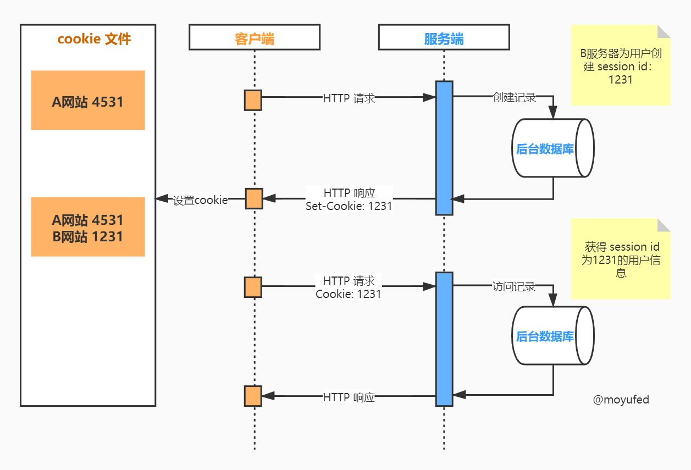

## 了解 cookie 和 session

### 为何需要 cookie 和 session？

首先来了解 HTTP （HyperText Transfer Protocol 超文本传输协议） 的几个特性：

- HTTP 建立于客户端-服务端（client/server）模型之上，浏览器发送请求，Web服务器接收请求后向客户端发送响应信息

- HTTP 是无状态的（stateless）协议，每一次传输都是独立的，互不影响。

- HTTP 是一个应用层 (application layer) 协议，在传输层（transfer layer）协议之上，使用（TCP）作为传输层协议。

- 客户端请求服务端使用不同的请求方式（包括：GET、POST、DELETE、PUT 等）。

- HTTP 定义了服务端状态码返回给客户端（如：200、404、500）。

- HTTP 支持设置头部 headers，（包括：Cache-Control、Content-type 等）。

http请求报文：

  

HTTP 是无状态的，意味着每次页面加载、每次请求都是独立的事件，和前后的事件没有关联。客户端请求服务之后，服务端不能区分发起 HTTP 请求的用户以及用户在网站的状态等，Cookie 和 Session 使 HTTP 能够维持状态，让网站能够记住用户的一些信息。

### Cookie & Session

Cookie 通常是由 **浏览器** 保存在用户电脑的小文本文件，经过浏览器转换成包含用户网站上的信息的文本，在浏览器发送 HTTP 请求的时候会把这些信息加在请求头中发送给服务端，服务端再根据 Cookie 来判断不同用户的信息。

Session 是 **服务端** 存储的用来标识用户信息的数据，当用户访问网站时，服务器会为这个用户创建一个唯一的 session id，服务器会把这个id通过 cookie 的形式传给浏览器，浏览器接收 cookie 之后，请求就能携带这个 cookie 访问服务器，通过这个session id 服务端就能够对访问的用户进行辨别。



举个栗子：

商店发的会员卡（cookie），它记录了用户的信息（identification），并且是由商店（服务器）发给用户（浏览器），每次用户去商店消费都会携带着会员卡，由于商店管理了自己发布的会员卡信息，可以通过用户会员卡ID（session id）找到该用户的信息。


### Session cookies 和 Persistent cookies

- 会话 cookie（Session cookies）在浏览网页时被创建，通常放在活动内存，会话结束时（浏览器关闭）会被删除。
- 持久化 cookie（Persistent cookies）浏览网页是被创建，并且没有失效之前，始终存在于浏览器的 cookie 存储目录，在到达失效日期时会被删除。

### Cookie 包含的内容

通常 cookie 都会包含以下内容：
- Cookie 来源的服务器名称
- Cookie 保存的时间
- 随机生成的唯一的数值

Cookie 是一个很小的文本文件，通常会被命名为类似 abc@example.com.txt 的文件，如果打开这些文件，可以看到类似如下的内容:

```
HMP1 1 example.com/ 0 4058205869
384749284 403847430 3449083948 *
```

Google Chrome 浏览器使用 SQLite 文件存储 cookie ，默认存储在：

```
C:\Users\<your_username>\AppData\Local\Google\Chrome\User Data\Default\
```
并且 Cookie 的值被加密了，因此无法直接打开。

### Cookie 相关

- 不设置 cookie 过期时间，cookie 会在会话结束后销毁
- 持久 cookie 无法改成会话 cookie，除非删除再重新创建 cookie
- 将 cookie 的 `domain` 选项设置为主域名，子域名可以携带该 cookie 的发送到服务器

### 如何使用 cookie？

#### 服务端

服务器通过响应头 `Set-Cookie` 来告诉浏览器创建一个 cookie，`Set-Cookie` 的值一个字符串，其格式如下：

```
Set-Cookie: <name>=<value>[; expires=<date>][; domain=<domain>][; path=<path>][; secure][; httponly]
```

上面的格式中，“[]” 内部都是可选值，他们分别有如下作用：

- `<name>=<value>` - 储存的字符串，会被浏览器携带发送回服务器，通常是一个 `name=value` 格式的字符串
- `expires` - Cookie 的过期时间，不设置的话，创建的 cookie 在会话结束后销毁，格式为 `DD-Mon-YYYY HH:MM:SS GMT` 
- `domain` - Cookie 被设置的域，只有向该域发送 HTTP 请求时才会携带对应的 cookie 
- `path` - Cookie 被设置的路径，之后向该路径发起请求才会携带对应的 cookie 
- `secure` - 一个 boolean 标记 cookie 是否只能通过 HTTPS 请求发送至服务器。
- `httponly` - 告诉浏览器该 cookie 不能通过 JavaScript 访问，可以阻止跨站脚本攻击（XSS）窃用 cookie。

可以返回多个 `Set-Cookie` 头来设置多个 cookie：

```
Set-Cookie: name=moyufed; path=/; expires=Mon, 26 Jul 2021 11:10:02 GMT; domain=localhost
Set-Cookie: name2=moyufed2; path=/; expires=Mon, 26 Jul 2021 11:10:02 GMT; domain=localhost
```

#### 客户端

JavaScript 通过 `document.cookie` 进行 cookie 的操作，但是仅限于非 `httpOnly` 的情况：

获取 cookie：

```javascript
document.cookie
```

创建或修改 cookie：

```javascript
document.cookie="name="+username;
```

在浏览器发送请求时，会将 cookie 添加到请求头中，如果有多个 cookie，将以分号和空格分隔，cookie 的格式如下：

```
Cookie: name=moyufed; name2=moyufed2
```

### 在 koa 中使用 cookie

Koa 已经提供了从通过上下文（`ctx`）直接读写入 cookie 的方法，分别为：

- `ctx.cookies.get(name, [options])` -  通过上下文读取 cookie
- `ctx.cookies.set(name, value, [options])` - 通过上下文写入 cookie

```javascript
ctx.cookies.set(
    'name', 
    'moyufed',
    {
        domain: 'localhost', // 设置 cookie 的域
        path: '/', // 设置 cookie 的路径
        maxAge: 24 * 60 * 60 * 1000, // cookie 的有效时间 ms
        expires: new Date('2020-10-10'), // cookie 的失效日期，如果设置了 maxAge，expires 将没有作用
        httpOnly: false, // 是否要设置 httpOnly
        overwrite: false // 是否要覆盖已有的 cookie 设置
    }
)
```

上面的代码没有设置 httpOnly，通过 `document.cookie` 可以获取到 `"name=moyufed"`，在访问 `'/'` 路径时，可以看到请求头里面携带了设置的 cookie。事实上 koa2 使用了 npm 的 [cookies](https://github.com/pillarjs/cookies) 模块来读写 cookie，上面的配置都可以从  cookies 源码查看。

### 如何使用 session？

Session 存储在服务端，不会在网络中进行传输，但服务器产生的 session id 会以 cookie 存在客户端。

用户通过浏览器访问 web 站点，服务器会产生一个唯一的 session id，通过 `Set-Cookie` 响应头将其发送到浏览器，之后浏览器发送的请求都会自动携带这个 cookie，服务器根据 cookie 获取到的 session id 来获得存储在服务端的用户的信息。

用户信息储存的方式可以是内存（Redis）或数据库。

### 在 koa 中使用 session

Koa2 没有提供直接设置 session 的操作，但也有很多用于操作 session 的中间件，这里将使用 [koa-session-minimal](https://www.npmjs.com/package/koa-session-minimal) 中间件来处理 session，并且还将使用 [redis](https://redis.io/) 作为储存介质。同样，也有 [koa-redis](https://www.npmjs.com/package/koa-redis) 来为 koa 的 session 中间件提供 redis 储存。

关于 redis 的安装可以查看 [【前端开发日常 - 4】Windows安装Redis及简单使用](https://moyufed.com/2020/10/01/%E3%80%90%E5%89%8D%E7%AB%AF%E5%BC%80%E5%8F%91%E6%97%A5%E5%B8%B8-4%E3%80%91Windows%E5%AE%89%E8%A3%85Redis%E5%8F%8A%E7%AE%80%E5%8D%95%E4%BD%BF%E7%94%A8/) 。

安装中间件：

```shell
$ npm install koa-session-minimal koa-redis
```

示例代码：

```javascript
// app.js

const Koa = require('koa'); // 引入koa
const Router = require('koa-router');

const session = require('koa-session-minimal');
const redisStore = require('koa-redis');

const app = new Koa(); // 创建 koa 应用
const router = new Router(); // 使用 koa-router

// 存放 sessionId 的 cookie 配置，根据情况自己设定
let cookie = {
    maxAge: 60 * 60 * 1000, // cookie 有效时长(ms)
    expires: '',  // cookie 失效时间
    path: '', // 写 cookie 所在的路径
    domain: '', // 写 cookie 所在的域名
    httpOnly: true, // 是否只用于 http 请求中获取
    overwrite: true,  // 是否允许重写
    secure: '',
    sameSite: '',
    signed: true,
}

app.use(session({
    key: 'SESSION_ID', // 使用 SESSION_ID 来作为 redis key 的前缀
    store: redisStore(),
    cookie: cookie // 设置 session id 储存的 cookie
}))

router.get('/', async ctx => {
    ctx.body = 'Hello world!';
})

router.get('/get', async ctx => {
    // 读取和修改 session 信息
    ctx.session.count = ctx.session.count + 1
    ctx.body = ctx.session;
})

router.get('/set', async (ctx) => {
    // 设置 session
    ctx.session = {
        id: Math.random().toString(36).substr(2), // 随机 id
        count: 0
    }
    ctx.body = ctx.session;
})

app.use(router.routes()).use(router.allowedMethods());

// 启动服务监听本地3000端口
app.listen(3000, () => {
    console.log('应用已经启动，http://localhost:3000');
})
```

上面的代码中，通过 `require();` 引入了 koa 的中间件，并且在使用时传递了设置信息，通过访问 http://localhost:3000/set 和  http://localhost:3000/get  分别设置和获取 session。当客户端访问对应 URL 时，服务端将 session 数据进行存储，而在浏览器访问 http://localhost:3000/get  将会看到 session 存储的数据：

```
{"id":"7zcj87rsyd","count":1}
```

通过查看请求，可以看到中间件管理了 session id 的产生以及 cookie 的设置，它会产生唯一的 `SESSION_ID` 返回给浏览器：


而在 redis 中也能够看到存储的 session 数据：


### 总结

通过前面的介绍，我们了解到：

- Web 开发中引入 cookie 和 session 的原因（HTTP 的无状态）
- Cookie 和 session 的区别
- Cookie 包含的内容和用法
- Cookie 与 session 的工作方式

### 参考资料

https://www.allaboutcookies.org/cookies/

https://www.privacypolicies.com/blog/browser-cookies-guide/

https://stackoverflow.com/questions/31021764/where-does-chrome-store-cookies